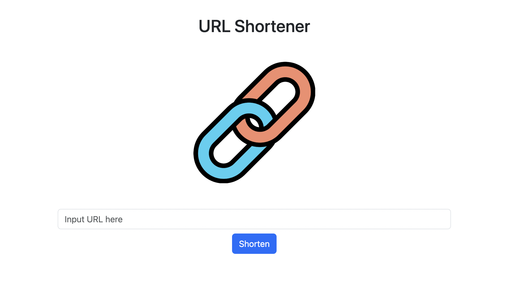
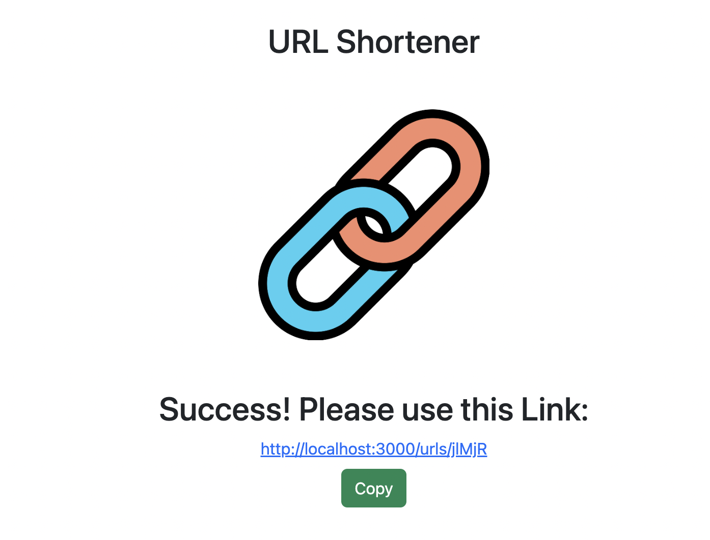

# shortenURL

一個使用 Node.js + Express 打造的短網址產生器

[Demo Website](http://localhost:3000/home)

## 專案畫面




## Features - 產品功能

1. 使用者可以將網址貼進輸入框，網頁會自動產生一個短網址供使用者使用。
2. 只要伺服器有在運行的情況下，用戶在瀏覽器使用任何該網頁產生的網址都能夠成功導到使用者輸入的網址。
3. 使用者可以點擊 Copy 按鈕進行複製或是直接點選該連結導入網頁。
4. 如果原網址有變更，使用者可以先將原網址貼上找出原來的縮址再利用 edit 更變成新網址

## Environment SetUp - 環境建置

1. [Node.js](https://nodejs.org/en/)
2. [MongoDB4.0 以上]（https://www.mongodb.com/try/download/community）

## Using tool - 使用工具

1. Node.js v12.22.12
2. Nodemon
3. Express v4.18.2
4. Express-Handlebars v4.0.6
5. Bootstrap v5.3.8
6. mongoose v7.0.0
7. dotenv v16.0.3
8. body-parser: v1.20.2

## Installing - 專案安裝流程

1. 打開你的 terminal，Clone 此專案至本機電腦

```
git clone https://github.com/WeiWayne1030/URLShowter.git
```

2. 開啟終端機(Terminal)，進入存放此專案的資料夾

```
cd URLShowter
```

3. 安裝 npm 套件

```
在 Terminal 輸入 npm install 指令
```

4.安裝 express 套件

```
在 Terminal 輸入 npm install express@4.18.2 指令
```

5. 安裝 nodemon 套件

```
在 Terminal 輸入 npm install -g nodemon
```

6. 請自行新增.env 檔案放置與資料庫 MongoDB 連線相關資料

7. 啟動伺服器，輸入執行專案

```
使用 npm run dev 執行
```

8. 當 terminal 出現以下字樣，表示伺服器與資料庫已啟動並成功連結

```
Express is listening on http://localhost:3000
mongodb connected!
```

## Contributor - 專案開發人員

> [Wayne Sun]([https://github.com/WeiWayne1030])
